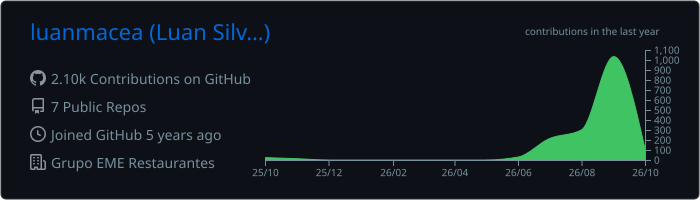
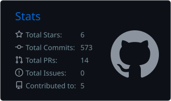
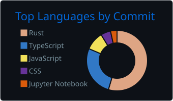

  
  
  

---

## 👨‍💻 About me

I'm a **back-end engineer** who builds APIs, data layers and the systems around them — and ships them end to end. I work mostly with **Java / Spring Boot** and **Python / FastAPI**, and I'm comfortable crossing into React, React Native and native desktop (Rust) when the product needs it.

- 🏢 Building an internal full-stack platform at **Grupo EME Restaurantes** — async REST API in **FastAPI + SQLAlchemy 2.0**, **JWT + RBAC** scoped per restaurant, a tested financial engine and analytics over a read-only data lake
- 💼 Before that, **2.5 years at Arista Digital** shipping Spring Boot services with JPA/Hibernate, JUnit/Mockito and code reviews in a Scrum team
- 🛠️ Creator and maintainer of **[RAM](https://github.com/luanmacea/roblox-account-manager)**, a Rust + Tauri desktop app for the Roblox community
- 🏆 **2x champion** of FIAP NEXT (2023 and 2025) · 🥈🥉 national medalist at the Brazilian Robotics Olympiad
- 🎓 Software Engineering at **FIAP** (2026) · 🌎 São Paulo, Brazil · Fluent in English

---

## ⭐ Featured project

<table>
<tr>
<td width="120" align="center" valign="top">
  
</td>
<td valign="top">

### [RAM — Roblox Account Manager](https://github.com/luanmacea/roblox-account-manager)

**The Roblox Account Manager built for the best user experience.** Keep every Roblox account in one place, run many clients at once and play on your alts without logging out — with Auto Rejoin, anti-AFK, server finder, friends join and encrypted storage.

</td>
</tr>
</table>

  

<table>
<tr><td>🦀 <b>Stack</b></td><td>Rust (Tokio, Win32 APIs) · Tauri 2 · React 19 · TypeScript · Tailwind</td></tr>
<tr><td>🔐 <b>Security</b></td><td>Accounts always encrypted on disk (Argon2 + XSalsa20-Poly1305); closed allowlists for anything that injects input</td></tr>
<tr><td>🧪 <b>Quality</b></td><td>~3,300 automated tests (Rust + Vitest) gating every commit, CI on GitHub Actions</td></tr>
<tr><td>🚀 <b>Delivery</b></td><td>Signed auto-updates, per-user MSI with no admin prompt, every release scanned on VirusTotal and Windows Defender</td></tr>
</table>

  

---

## 🧩 More projects

<table>
<tr>
<td width="50%" valign="top">

### 🤖 [Feller AI](https://github.com/luanmacea/Feller_AI)
**🥇 1st place — FIAP NEXT 2025**

AI-powered investment assistant: portfolio dashboard with interactive charts, scenario simulator and AI recommendations (Llama). I designed the REST endpoints, the relational model and the back-end business rules.

`Java` `Spring Boot` `OpenAPI` `React Native` `TypeScript`

</td>
<td width="50%" valign="top">

### 📱 [React Native TypeScript template](https://github.com/luanmacea/ReactNativeTypeScript)
**The production-ready starter I use for every mobile app**

Expo SDK 57 + Expo Router, strict TypeScript, a token-based design system, TanStack Query + Zustand, React Hook Form + Zod, Jest and a mock mode to run without a back-end.

`React Native` `Expo` `TypeScript` `TanStack Query`

</td>
</tr>
<tr>
<td width="50%" valign="top">

### 🌧️ [Pé d'Água](https://github.com/luanmacea/pe-da-agua2.0)
**🥇 1st place — FIAP NEXT 2023**

Urban flood forecasting and monitoring: a mobile app for citizens and public APIs for mobility companies. I built the mobile app and helped shape the monetization strategy.

`React Native` `JavaScript` `Redux`

</td>
<td width="50%" valign="top">

### 🎮 Roblox Idle Bot
**Commercial product, built solo end to end**

Computer-vision automation shipped as a portable `.exe`, with its own licensing: RSA + HMAC-SHA256 tied to a hardware fingerprint, Tkinter launcher, PyInstaller packaging.

`Python` `Jython` `SikuliX` `Cryptography`

</td>
</tr>
</table>

---

## 🛠️ Tech stack

<b>Back-end</b> 
  

<b>Data & infrastructure</b> 
  

<b>Front-end & mobile</b> 
  

  Also: JPA/Hibernate · SQLAlchemy · Alembic · Pydantic · JUnit · Mockito · pytest · mypy · Swagger/OpenAPI · PL/SQL · Scrum

---

## 💼 Experience

| When | Where | What |
| :--- | :--- | :--- |
| 2026 — now | **Grupo EME Restaurantes** | Back-end of an internal full-stack platform: FastAPI + async SQLAlchemy, MySQL, Alembic migrations, JWT/RBAC, pytest + mypy strict, Docker |
| 2023 — 2026 | **Arista Digital** | Spring Boot REST services, JPA/Hibernate, relational modeling, JUnit/Mockito, code reviews, React/React Native integration |

---

## 📊 GitHub stats

  

  
  

  

  <picture>
    <source media="(prefers-color-scheme: dark)" srcset="https://raw.githubusercontent.com/luanmacea/luanmacea/output/github-snake-dark.svg" />
    <source media="(prefers-color-scheme: light)" srcset="https://raw.githubusercontent.com/luanmacea/luanmacea/output/github-snake.svg" />
    
  </picture>

Stats cards and the snake are regenerated every day by GitHub Actions in this repository.

⭐ **If RAM helps you, a star on the repo helps it reach more players.**

